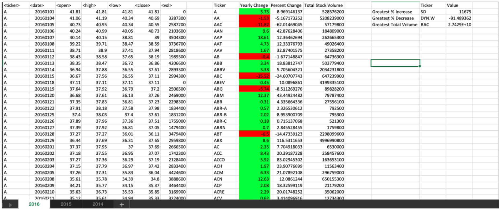
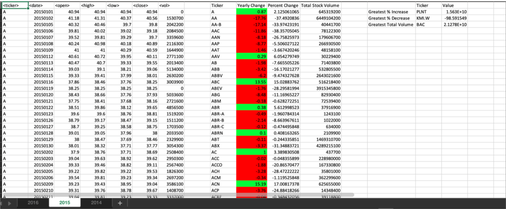
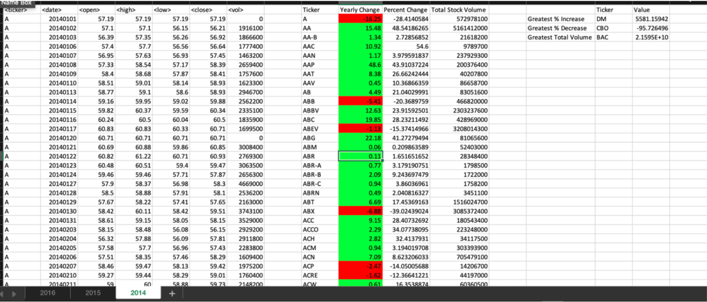

# The_VBA_of_Wall_Street

## Background
Use VBA scripting to analyze real stock market data.

## Technologies Used
- Excel
- VBA

## Objective
Create a script that will loop through all the stocks for one year and output the following information.
- The ticker symbol.
- Yearly change from opening price at the beginning of a given year to the closing price at the end of that year.
- The percent change from opening price at the beginning of a given year to the closing price at the end of that year.
- The total stock volume of the stock.
- Return the stock with the "Greatest % increase", "Greatest % decrease" and "Greatest total volume". 
- Make the appropriate adjustments to your VBA script that will allow it to run on every worksheet, i.e., every year, just by running the VBA script once.

